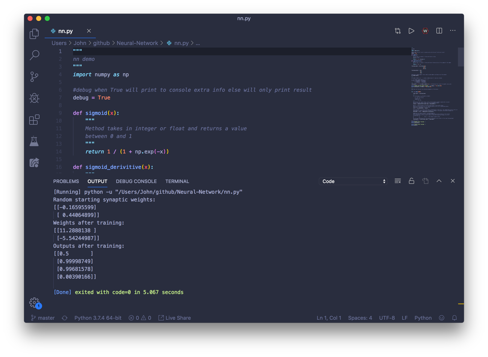

# Neural-Network
Neural Network created using mathematics and Numpy (Proof of concept)

# Requirements
Numpy module
* link to download: https://pypi.org/project/numpy/
* link to docs: https://numpy.org

# Preview
* trained network to ouput [0,1,1,0] based on training data

